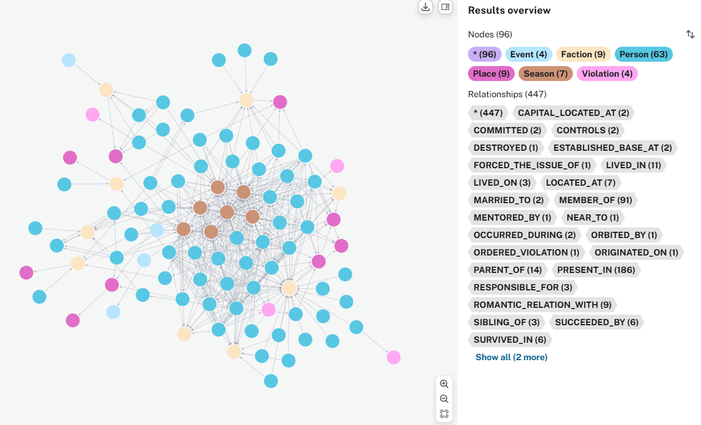
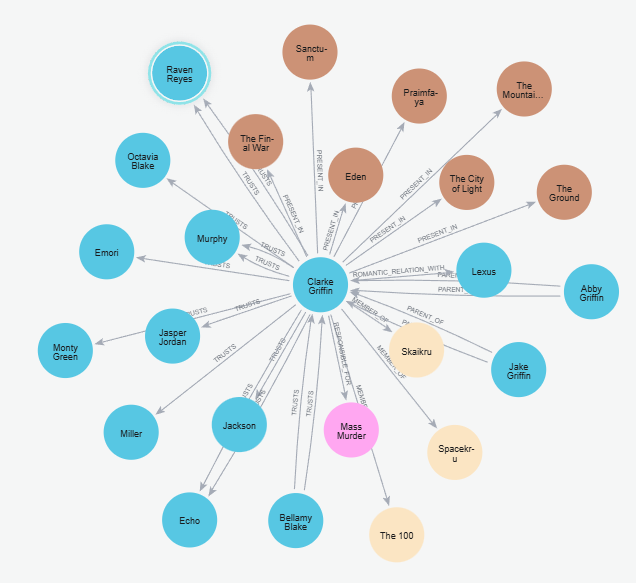
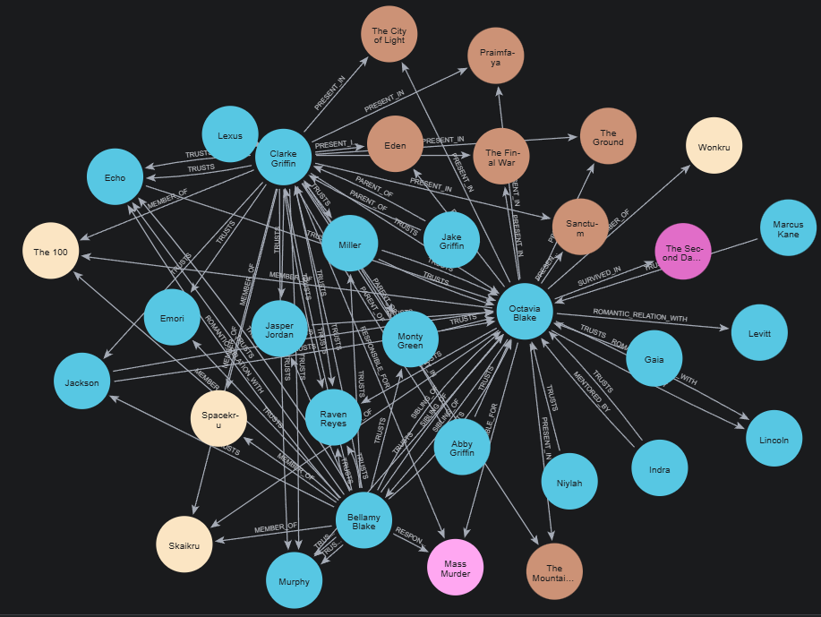

# Projet Vélib' Paris : Planificateur de Route en Temps Réel

Ce projet est une application web minimaliste et gratuite, développée avec **Python** et **Flask**, qui permet aux utilisateurs de visualiser en temps réel l'état des stations Vélib' à Paris et de planifier des itinéraires cyclables précis.

---

## Table des Matières

1.  [ProjetVelib](#configuration-du-projet-velib)
    * [Pré-requis](#pré-requis)
    * [Installation des Dépendances](#installation-des-dépendances)
    * [Déploiement avec Docker Compose](#déploiement-avec-docker-compose)
        * [Service Docker](#services-docker)
        * [Docker-compose ](#docker-compose)
    [Fonctionnalités de l'application](#fonctionnalités-de-lapplication)
    [Aperçu du Résultat](#aperçu-du-résultat)
    * [Vue d'Ensemble du Réseau Parisien](#vue-densemble-du-réseau-parisien)
    * [Démonstration de Routage Cyclable](#démonstration-de-routage-cyclable)
    [Défis Surmontés](#défis-surmontés)
    [Conclusion du Projet](#conclusion-du-projet)
2.  [ProjetThe100](#projet-the100--modélisation-des-systèmes-complexes-vie-neo4j)
    * [ConfigurationEnvironnement](#configuration-de-lenvironnement)
    * [StructureFichier](#Structure-des-Fichiers)
    * [ConfigurationConnexion](#Configuration-de-la-Connexion)
    * [Exécution du Script d'Importation](#exécution-du-script-dimportation-datapy)
        * [Service Docker](#Nettoyage-Automatique)
        * [Fractionnement des Requêtes](#fractionnement-des-requêtes)
        * [Compteurs et Vérifications](#compteurs-et-vérifications)
    * [Types de Nœuds](#types-de-nœuds)
    * [Types de Relation](#types-de-Relations)
    * [Défis de Modélisation Surmontés](#défis-de-modélisation-surmontés)
    * [Résultats graphiques](#résultats-graphiques)
    * [Résumé](#conclusion)

---

## Configuration du Projet Velib

### Pré-requis

Pour exécuter ce projet localement, vous devez avoir :

* **Python 3.8+**
* **Docker** installé afin de créer un container **MongoDB** grâce à un docker-compose.yml
* **Accès aux données Vélib'** (la base de données est configurée pour `velib_Paris`).

### Installation des Dépendances

Installez toutes les bibliothèques requises :

```bash
# Installe les dépendances requises
pip install flask pymongo python-dotenv folium geopy requests polyline
```
### Déploiement avec Docker Compose

Pour exécuter facilement l'application Flask ainsi que sa base de données MongoDB dans un environnement isolé et reproductible, le projet inclut une configuration **Docker Compose**.

---

####  Services Docker

| Service | Rôle | Configuration importante |
|---------|------|---------------------------|
| **web (Flask App)** | Sert l’application et génère la carte interactive Vélib’ | • Construit l’image depuis le `Dockerfile`<br>• Lit l’URI MongoDB via la variable d’environnement **MONGO_URI**<br>• Communique automatiquement avec MongoDB grâce au réseau Docker |
| **mongo (MongoDB)** | Base de données contenant les stations Vélib’ | • Utilise un volume Docker pour **conserver les données**<br>• Le nom du conteneur (`mongo`) sert d’hôte interne pour la connexion |

---

#### Docker-compose 

Voici ci-dessous un échantillon du docker-compose :

``` yaml
version: '3.8'

services:
  mongo:
    image: mongo:7
    container_name: mongodb
    restart: unless-stopped
    environment:
      MONGO_INITDB_ROOT_USERNAME: admin
      MONGO_INITDB_ROOT_PASSWORD: admin
    ports:
      - "27017:27017"
    volumes:
      - mongo_data:/data/db
```

 Voir le fichier complet :  
[docker-compose.yml](/VELIB/docker-compose.yml)

---

## Fonctionnalités de l'application

* **Visualisation en Temps Réel** : Les marqueurs de stations sont colorés selon la disponibilité des vélos (Vert pour disponible, Rouge pour vide).
* **Planification d'Itinéraire (Routage Cyclable)** : Utilisation de l'API **OSRM (Open Source Routing Machine)** pour tracer des chemins précis qui suivent les routes cyclables réelles.
* **Informations de Navigation** : Affiche la distance totale, la durée estimée du trajet, et des instructions détaillées étape par étape.
* **Interface Simple** : Une barre latérale fixe gère la sélection des stations de départ et d'arrivée.

---

## Aperçu du Résultat


Pour illustrer le fonctionnement de cette application, nous présentons deux vues clés. Les images se trouvent dans le dossier **`VELIB/Image/`**.

### Vue d'Ensemble du Réseau Parisien

Cette image montre la densité des stations et leur statut de disponibilité actuel dans Paris.

| Couleur | Statut | Description |
|---------|---------|-------------|
| 🟩 **Vert** | Stock élevé | Vélos disponibles en grand nombre avec un grand nombre de place disponible  |
| 🟧 **Orange** | Stock modéré | Vélos disponibles mais quantité moyenne avec peu de place disponible |
| 🟥 **Rouge** | Très faible stock | Très peu de vélos encore disponibles et un nombre de place très restreint |


### Démonstration de Routage Cyclable

**Cette capture met en évidence la fonctionnalité principale : le planificateur de route.**
* On peut programmer un trajet d'un point A à un point B. Si la station d'arrivée à une **disponiblité quasi nulle**, elle s'affichera en **noir**.
* On retrouve également **la durée estimée du trajet** ainsi que **sa distance à parcourir**
* On a également tout en bas, la liste des instructions de route à suivre pour arriver le plus vite.


---

## Défis Surmontés

### Stabilité de l’Interface (Flask / JS)
Résolution du problème classique du `onchange` en Flask, qui causait :  
- des rafraîchissements intempestifs  
- un comportement non prévisible  
→ L’interface est désormais fluide et stable.

### Défis liés aux APIs de Routage

Lors du développement, plusieurs solutions de routage géospatial ont été testées avant d’aboutir à une version stable. Deux APIs se sont révélées difficiles ou incompatibles avec les objectifs du projet :

####  OpenRouteService (ORS)
L’intégration d’ORS a échoué pour plusieurs raisons :
- **Problèmes d’authentification** : la clé API encodée était sensible au format exact attendu, entraînant des erreurs récurrentes.
- **Snapping trop strict** : l’API impose d'accrocher précisément les coordonnées aux routes.  
  → Cela provoquait des messages d’erreur du type *“Route not found”* même pour des trajets valides dans Paris.
- **Instabilité générale** pour des trajets courts ou très urbains comme ceux des stations Vélib’.

####  Google Maps Directions API
Google Maps Directions n’a finalement pas été intégrée car :
- elle nécessite systématiquement **un compte de facturation actif**,  
- c’est un **service payant**, même pour une utilisation basique,
- cela allait à l’encontre de l’objectif du projet : **rester 100% gratuit et open source**.

Ces contraintes ont mené au choix d’**OSRM**, une solution open source, performante et complètement gratuite, parfaitement adaptée aux besoins du projet.
L’utilisation de la librairie `polyline` a permis de décoder les données envoyées par OSRM,
transformant une simple ligne droite en **véritable itinéraire navigable** conforme au réseau routier.

---

## Conclusion du Projet

Ce projet combine trois domaines techniques majeurs pour offrir une solution complète et cohérente :

### 1. Gestion de la Donnée (MongoDB)
L’application se connecte à une base de données NoSQL pour récupérer un jeu de données complexe :  
les stations Vélib' ainsi que leur statut dynamique (vélos disponibles, places libres, etc.) doivent être actualiser très souvent

### 2. Architecture Web (Python Flask)
Flask sert de pont entre l'utilisateur et la logique métier :  
- gestion des requêtes HTTP  
- maintien de l’état du formulaire (départ / arrivée)  
- coordination des processus (sélection → requête → affichage)

### 3. Cartographie & Routage (Folium & OSRM)
L’application dépasse la simple visualisation :  
- intégration d’un moteur de routage open source (OSRM)  
- tracé précis suivant les routes réelles  
- calcul de la durée du trajet  
- génération d’instructions détaillées

---


# Projet The100 : Modélisation des Systèmes Complexes vie Neo4J

Ce projet est une étude de cas en modélisation de données démontrant la puissance des bases de données graphes (Neo4j) pour analyser les relations complexes, la dynamique des conflits et la chronologie d'un univers narratif riche comme *The 100*.

L'objectif principal était de migrer une structure de données typiquement relationnelle vers un modèle sémantique plus performant pour l'analyse de réseau.

---

## Configuration de l'environnement


Le projet est configuré pour être exécuté avec le driver Python de Neo4j dans un environnement sécurisé (VS Code), sans dépendre d'extensions graphiques ni de l'interface Neo4j Desktop.

---

## Structure des Fichiers

Le cœur du projet se trouve dans le sous-dossier `The100/` :

| Fichier | Rôle |
|---------|-------|
| `.env` | Stockage sécurisé et privé |
| `the100_data.cypher` | Contient le schéma complet du graphe (75+ entités, 150+ relations). Source de vérité des données. |
| `data.py` | Script Python chargé de l'importation des données dans Neo4j. |

---

## Configuration de la Connexion

L'application établit une connexion stable à Neo4j via le script `data.py` vers le driver officiel `neo4j` :

```
CYPHER_FILE = "the100_data.cypher"
uri = os.getenv("NEO4J_URI", "bolt://localhost:7687")
user = os.getenv("NEO4J_USER", "neo4j")
password = os.getenv("NEO4J_PASSWORD")
database_name = "the100"
```

Je me connecte à l'instance `SDV` dans la base de donnée `the100`.

## Exécution du Script d'Importation (`data.py`)

Le script d'importation assure un chargement fiable et reproductible des données Cypher.

### Nettoyage Automatique

Avant l’importation :

```cypher
MATCH (n) DETACH DELETE n
```

→ Assure que chaque exécution repart d’une base vierge.

### Fractionnement des Requêtes

Pour contourner les erreurs du type :

```
Expected exactly one statement per query
```

Le script :
- lit le fichier `.cypher`,
- sépare les requêtes par `;`,
- supprime les commentaires,
- exécute chaque instruction individuellement.

### Compteurs et Vérifications

À la fin du traitement, le script affiche :

- **Nœuds créés : X**
- **Relations créées : Y**

Soit :

``` yaml
Base vidée.
Importation de 190 requêtes…

--- Importation réussie ---
Nœuds créés : 112
Relations créées : 447
```

Cela permet de vérifier facilement que l’importation est complète et cohérente.
Ce module assure une exécution fiable, sécurisée et automatisée du chargement des données dans Neo4j.


## Types de Nœuds

Le graphe est construit sur une base de plus de 66 personnages et comporte plus de 440 relations, organisées autour de six types de nœuds principaux :

| Type de Nœud | Rôle dans le Graphe | Nombre d'Entités | Exemples |
|--------------|----------------------|-------------------|----------|
| :Person | Personnages principaux et leurs attributs (genre, statut) | 75+ | Clarke Griffin, Octavia Blake, Bellamy Blake |
| :Faction | Groupes d'appartenance politique ou ethnique | 15+ | Skaikru, Wonkru, Disciples |
| :Place | Lieux de vie, villes, bunkers, vaisseaux | 15+ | Polis, Arkadia, Bardo |
| :Season | Unités temporelles pour analyses chronologiques | 7 | Season 1 à Season 7 |
| :Event / :Violation | Moments narratifs majeurs, crimes, catastrophes | 10+ | Praimfaya, Massacre at Mount Weather |

---

## Types de Relations

**Les relations capturent la complexité narrative tout en évitant les redondances.**

| Relation | Connexion | Exemple d'Analyse |
|----------|-----------|-------------------|
| MEMBER_OF | Person → Faction | Appartenance à Azgeda, Skaikru, Trikru |
| TRUSTS | Person ⇆ Person | Alliances de survie |
| ROMANTIC_RELATION_WITH | Person ⇆ Person | Clexa, Kabby |
| COMMITTED / RESPONSIBLE_FOR | Person → Violation | Clarke responsable d’un massacre |
| PRESENT_IN | Person → Season | Suivi chronologique des personnages |
| PARENT_OF | Person → Person | jake et Abby sont les parents de Clarke | 

---

## Défis de Modélisation Surmontés

- **Stabilité d'importation**  
  Résolution de l’erreur Python : "Expected exactly one statement per query"  
  → Solution : fractionnement adapté des requêtes Cypher.

- **Complexité relationnelle**  
  Utilisation stratégique de la clause `UNWIND` pour générer massivement des relations tout en maintenant des transactions fiables.

---

## Résultats graphiques

Voilà ci-dessous à quoi ressemble graphiquement les Nodes et relations de la série **The100**



En dessous, on peut voir toutes les relations au premier degrés que peut avoir l'héroine de la série **Clarke Griffin**

```bash
MATCH (c:Person {name: 'Clarke Griffin'})-[r]-(n)
RETURN c, r, n
```



```bash
MATCH (p:Person)-[r:COMMITTED|RESPONSIBLE_FOR|ORDERED_VIOLATION]->(v:Violation)
RETURN 
    p.name AS Auteur, 
    type(r) AS TypeResponsabilite, 
    v.name AS Violation, 
    v.severity AS Gravite
ORDER BY Gravite DESC, Auteur
```

On peut voir ci-dessous les principaux crimes qui ont été commis dans la série :


Ici, on peut voir les trois protagonistes de l'histoire :

```bash
MATCH (c:Person)-[r]-(n)
WHERE c.name IN ['Clarke Griffin', 'Bellamy Blake', 'Octavia Blake']
RETURN c, r, n LIMIT 50
```




Mais ils ne sont pas les seules. Voici le top10 des personnages clés de la série


| Rang | Personnage | TotalConnections | Rôle Analytique dans le Graphe |
|----------|-----------|---------------| -------------------------------|
|1| Octavia Blake | 35 | Le Hub de Conflit/Survie : Centrale à Wonkru, aux Grounders, et aux liens fraternels. |
|2| Clarke Griffin | 30 | Le Hub Exécutif : Impliquée dans les liens familiaux, les alliances politiques (Bellamy, Lexa), les événements majeurs et les violations. |
|3| Miller | 29 | Noyau de Loyauté/Garde : Lié aux 100, à Wonkru, à Spacekru, et à son partenaire (Jackson/Bryan). |
|4| Jackson | 28 | Noyau Médical/Relationnel : Lié à Abby (Mentor), Miller (Partenaire), et aux multiples factions de survie. |
|5| Raven Reyes | 27 | Le Pont Technique : Fortement liée aux ingénieurs, à Clarke/Bellamy et aux membres de Spacekru. |
|6| Murphy | 25 | Le Pivot : Central par ses liens de partenariat avec Emori et ses interactions avec tous les groupes (100, Wonkru, Sanctum). |
|7| Echo | 24 | L'Agent Double : Liaison entre Azgeda, Bellamy (famille), et Spacekru. |
|8| Bellamy Blake | 22 | Le Hub Fraternel : Centralité tirée de son lien avec Octavia et son rôle de co-leader des 100/Spacekru. |
|9| Abby Griffin | 19 | Le Nœud Matriarcal : Liée à Clarke (Famille), Kane (Amoureux), Jackson (Mentorat), et Skaikru. |
|10| Marcus Kane | 19 | Le Nœud Politique : Lié au Skaikru, Wonkru, et à Abby. |

---

## Conclusion

Ce projet démontre l'intérêt d’un modèle graphe pour analyser un univers narratif dense.  
Neo4j permet une compréhension intuitive des interactions, des responsabilités, des structures sociales et des évolutions temporelles parfait pour suivre une histoire.
