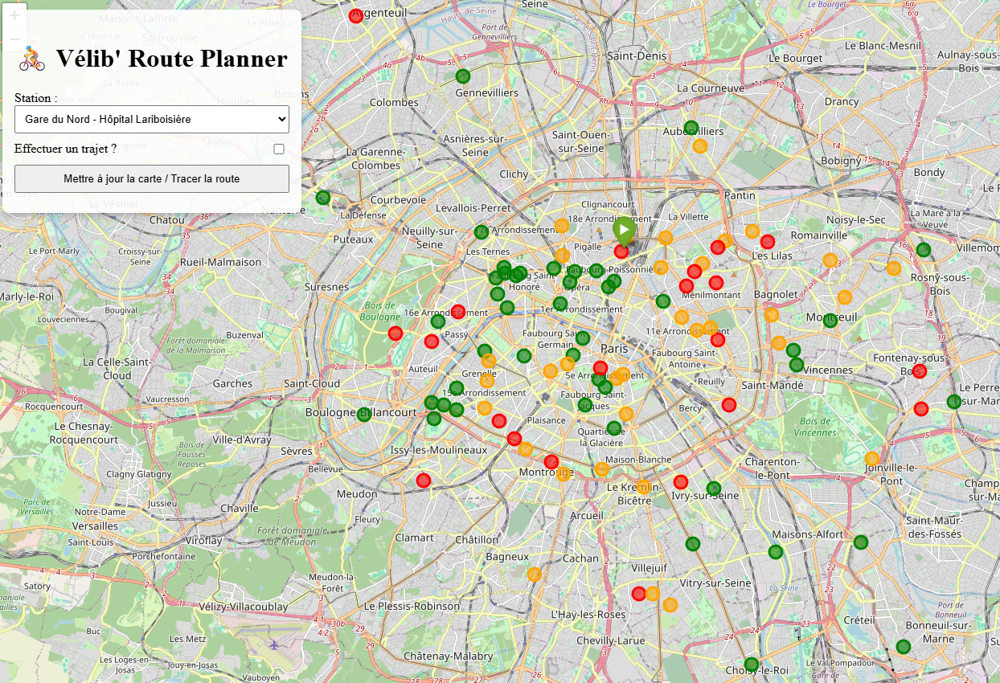
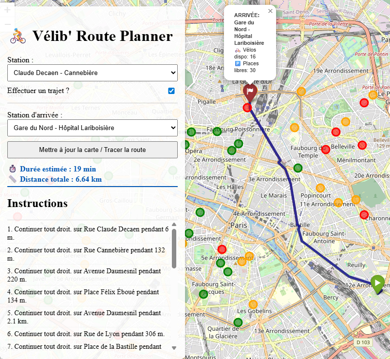

# 🚴‍♂️ Projet Vélib' Paris : Planificateur de Route en Temps Réel

Ce projet est une application web minimaliste et gratuite, développée avec **Python** et **Flask**, qui permet aux utilisateurs de visualiser en temps réel l'état des stations Vélib' à Paris et de planifier des itinéraires cyclables précis.

---

## 📑 Table des Matières

1.  [Fonctionnalités](#fonctionnalités)
2.  [Aperçu du Résultat](#aperçu-du-résultat)
3.  [Configuration du Projet](#configuration-du-projet)
    * [Pré-requis](#pré-requis)
    * [Installation des Dépendances](#installation-des-dépendances)
    * [Configuration des Accès](#configuration-des-accès)
4.  [Comment Lancer l'Application](#comment-lancer-lapplication)
5.  [Structure du Code](#structure-du-code)
6.  [Auteur](#auteur)

---

## ✨ Fonctionnalités

* **Visualisation en Temps Réel** : Les marqueurs de stations sont colorés selon la disponibilité des vélos (Vert pour disponible, Rouge pour vide).
* **Planification d'Itinéraire (Routage Cyclable)** : Utilisation de l'API **OSRM (Open Source Routing Machine)** pour tracer des chemins précis qui suivent les routes cyclables réelles.
* **Informations de Navigation** : Affiche la distance totale, la durée estimée du trajet, et des instructions détaillées étape par étape.
* **Interface Simple** : Une barre latérale fixe gère la sélection des stations de départ et d'arrivée.

---

## 🖼️ Aperçu du Résultat


Pour illustrer le fonctionnement de cette application, nous présentons deux vues clés. Les images se trouvent dans le dossier **`VELIB/Image/`**.

### 1. Vue d'Ensemble du Réseau Parisien

Cette image montre la densité des stations et leur statut de disponibilité actuel dans Paris.

| Couleur | Statut | Description |
|---------|---------|-------------|
| 🟩 **Vert** | Stock élevé | Vélos disponibles en grand nombre avec un grand nombre de place disponible  |
| 🟧 **Orange** | Stock modéré | Vélos disponibles mais quantité moyenne avec peu de place disponible |
| 🟥 **Rouge** | Très faible stock | Très peu de vélos encore disponibles et un nombre de place très restreint |



### 2. Démonstration de Routage Cyclable

**Cette capture met en évidence la fonctionnalité principale : le planificateur de route.**
On peut programmer un trajet d'un point A à un point B. Si la station d'arrivée à une **disponiblité quasi nulle**, elle s'affichera en **noir**.
On retrouve également **la durée estimée du trajet** ainsi que **sa distance à parcourir**
On a également tout en bas, la liste des instructions de route à suivre pour arriver le plus vite.



## 🛠️ Configuration du Projet

### Pré-requis

Pour exécuter ce projet localement, vous devez avoir :

* **Python 3.8+**
* **MongoDB** installé et en cours d'exécution.
* **Accès aux données Vélib'** (la base de données est configurée pour `velib_Paris`).

### Installation des Dépendances

Installez toutes les bibliothèques requises :

```bash
# Installe les dépendances requises
pip install flask pymongo python-dotenv folium geopy requests polyline